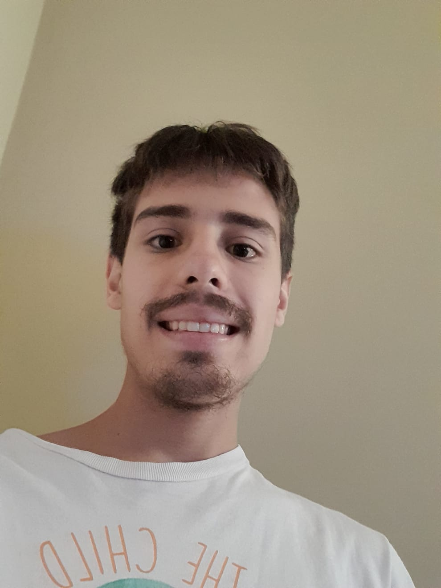

# Juan Ignacio Belforte

Hola, me llamo **Juan Ignacio** y este es mi tercer cuatrimestre en esta carrera, ya que recursé Programación estructurada. Vivo en Villa Sarmiento, Morón con mi mamá y mi hermana.

Me incribi en la carrera de programacion de videojuegos en 2023 y en programación en 2024 ya que quería hacer dos carrera de uno de mis gustos mas grandes. 

Siempre me gusto la computacion aunque nunca habia indagado muy profundo, pero me di cuenta que me encanta, y estoy bastante seguro que esto es lo que quiero hacer... no voy a decir que para siempre, pero si por mucho tiempo. Me encanta pensar cada proyecto como un acertijo a resolver, y usar la creatividad para resolverlo.

Estuve investigando mucho sobre Inteligencia artificial, y me interesa bastante.  Quiza en cuanto termine esta carrera podria meterme a la de IA, pero bueno, eso se vera

## Otra Información
- Tengo un canal donde subo tutoriales de diversos conocimientos 
- Tengo un gato que se llama Jamie

## Mis gustos

- Desde los 15 años que me encanta el anime. De chico, imagino que como muchos aficionados del anime, queria crear mi propio anime, por lo que me empeñe en aprender a dibujar hasta que llegue a un nivel medio, aprendi a hacer animaciones y a editar. Se me cayo el sueño cuando entendi cuanto les costaba a las casas animadoras crear un solo capitulo. 

- Pero igualmente descubri que me encanta dibujar y el anime, y claro, dibujar anime

- Mi proximo objetivo es poder mudarme solo y, si se puede, tener un gato, al cual llamaria Yugi, como el protagonista de Yu-Gi-Oh
